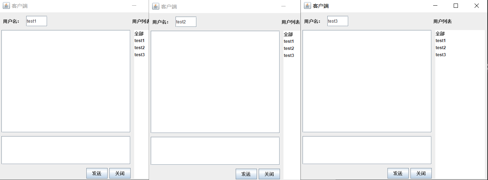
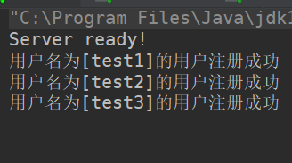
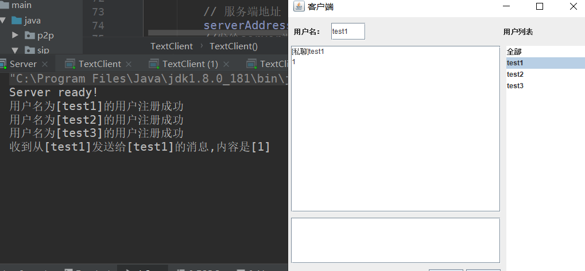
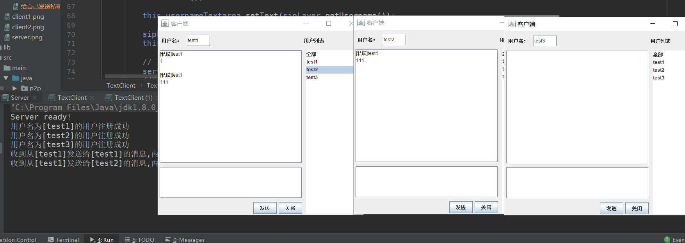
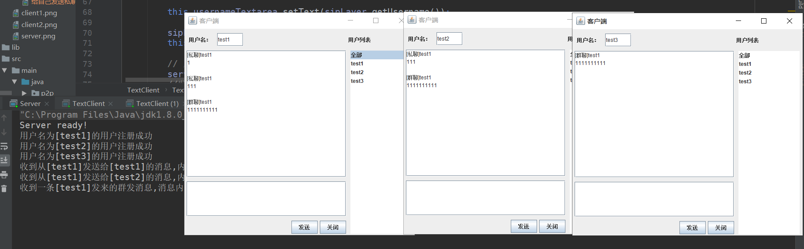
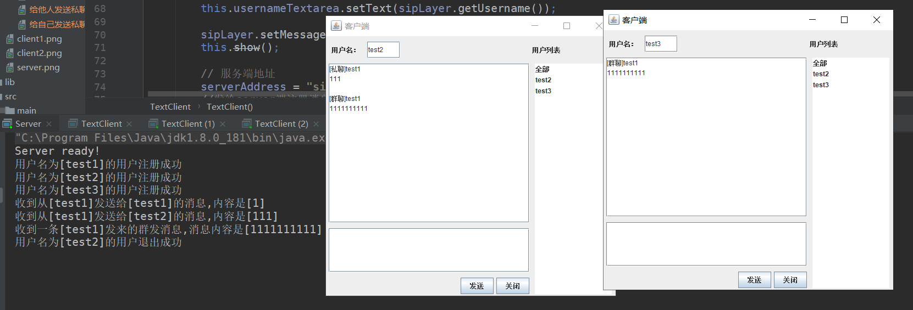
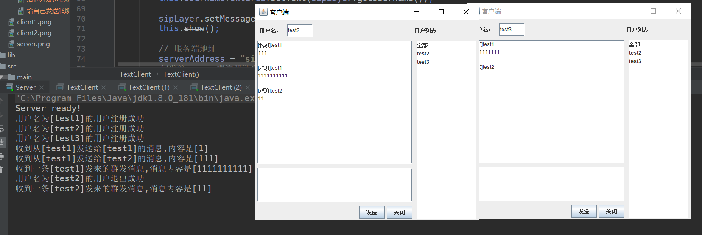
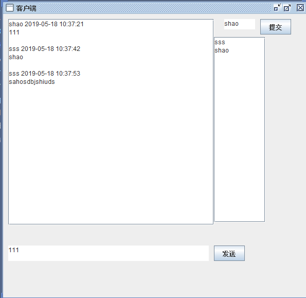
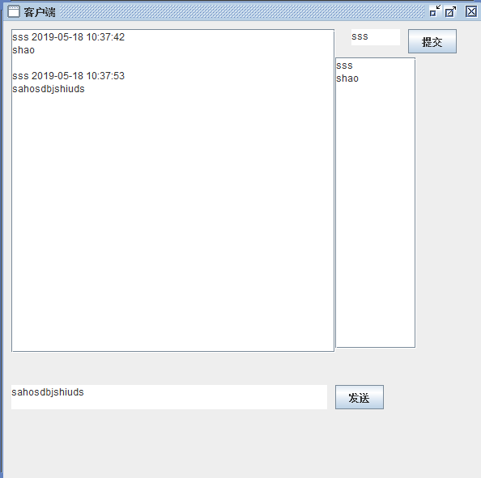
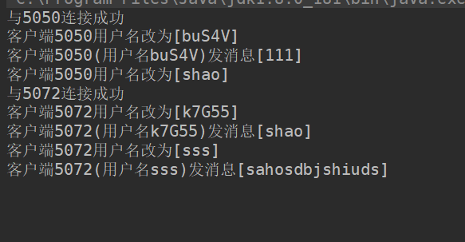

# ChatingRoom

Java实现的多人聊天系统

## sip

### 服务端
#### 不同消息类型
- **register** 将新用户信息保存,并向所有客户端发送更新后的用户列表
- **message** 
    - 接收端地址为空: 表示该消息为群发消息,向所有用户发送改消息
    - 接收端地址不为空: 表示该消息为私聊消息,向接收端地址私发消息
- **cancel** 将用户从用户列表删除 并给所有在线用户发送更新的用户列表
### 客户端
- 客户端初始化成功之后将给服务端发送**register**消息
- 每次点击发送按钮,将会给服务器发送**message**消息
- 客户端点击退出按钮将会给服务器发送**cancel**消息
- 客户端可以发送群聊消息和私聊消息
- 私聊消息还可以发送给自己

### 运行截图

注册成功后的客户端效果

注册成功后的服务端效果

给自己发送私聊消息

给他人发送私聊消息

发送群聊消息

一个客户端退出之后后面的用户列表刷新

一个客户端退出之后仍可正常发送消息

## p2p

### Done

- 群聊功能

- 实时显示最新的在线用户列表

- 用户启动客户端后会随机产生一个昵称,之后用户可以修改自己的id并实时更新在所有用户的在线用户列表和聊天记录中

### 程序运行界面

#### 客户端

#### 服务端

